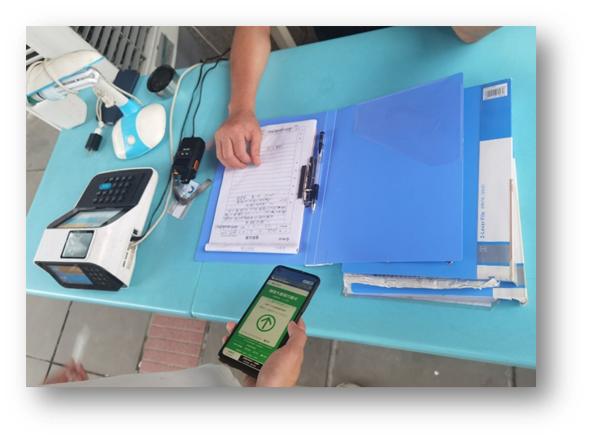
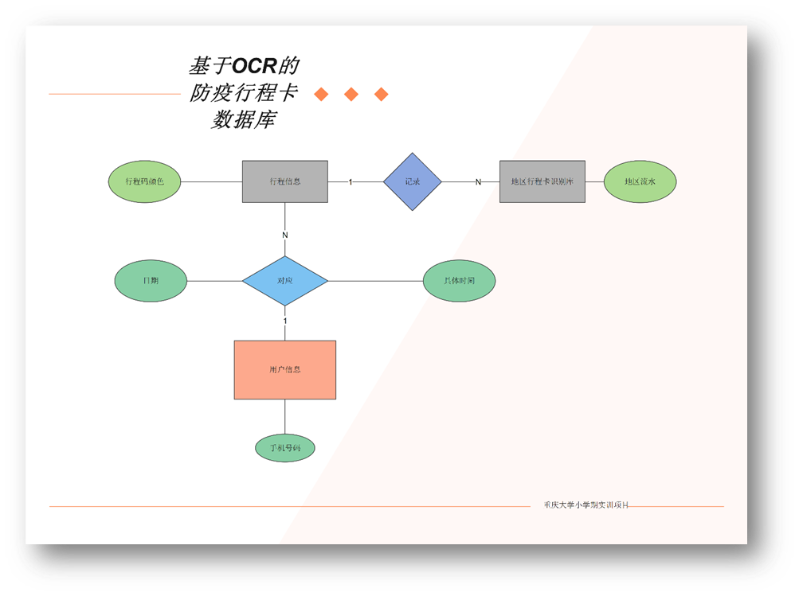
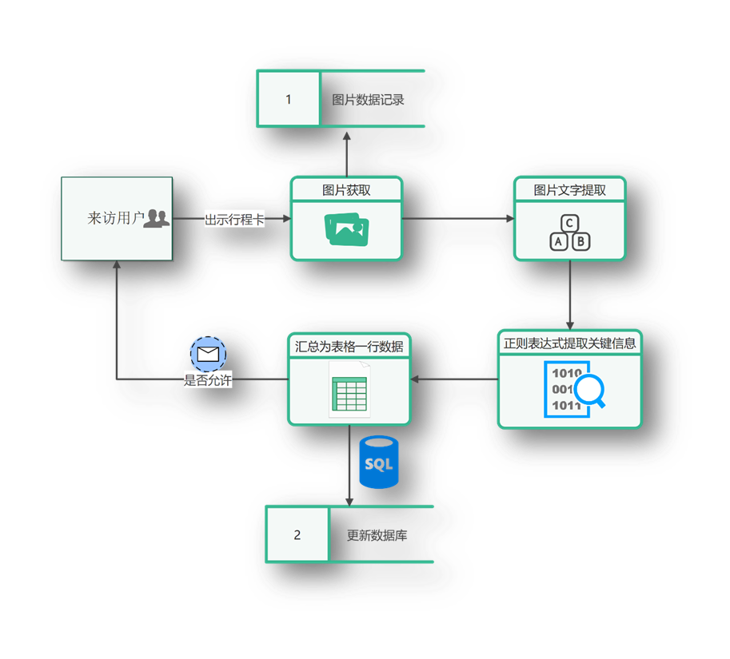
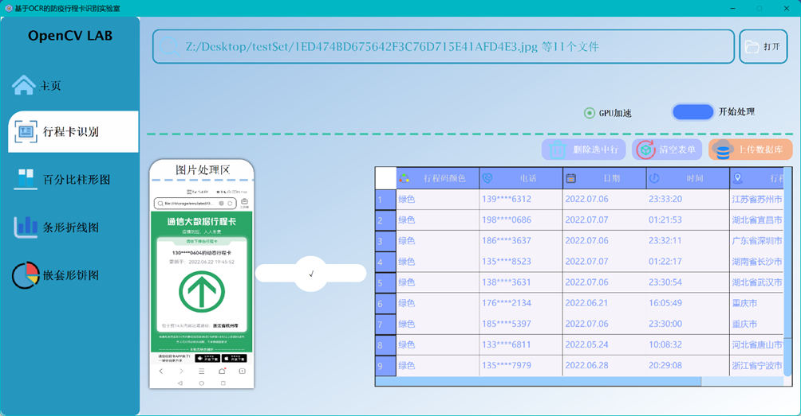
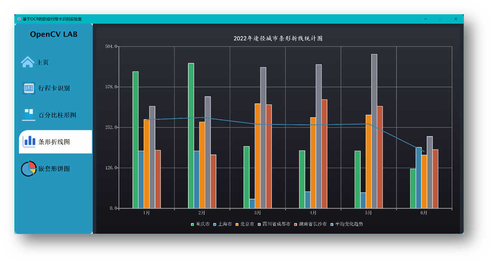
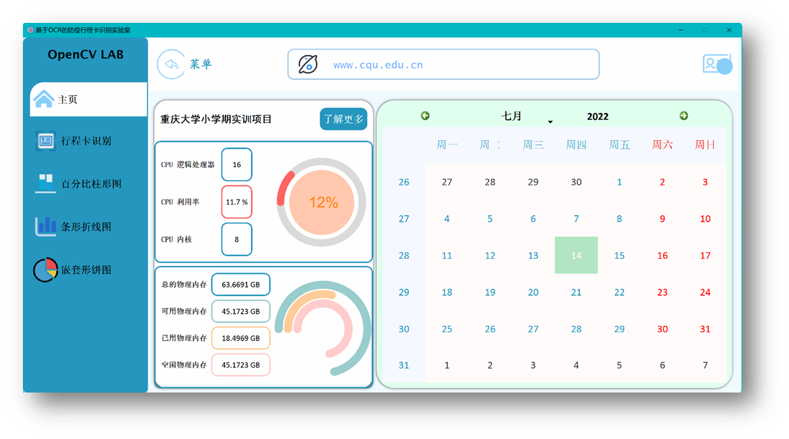
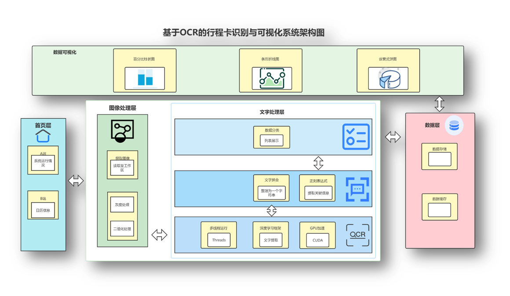
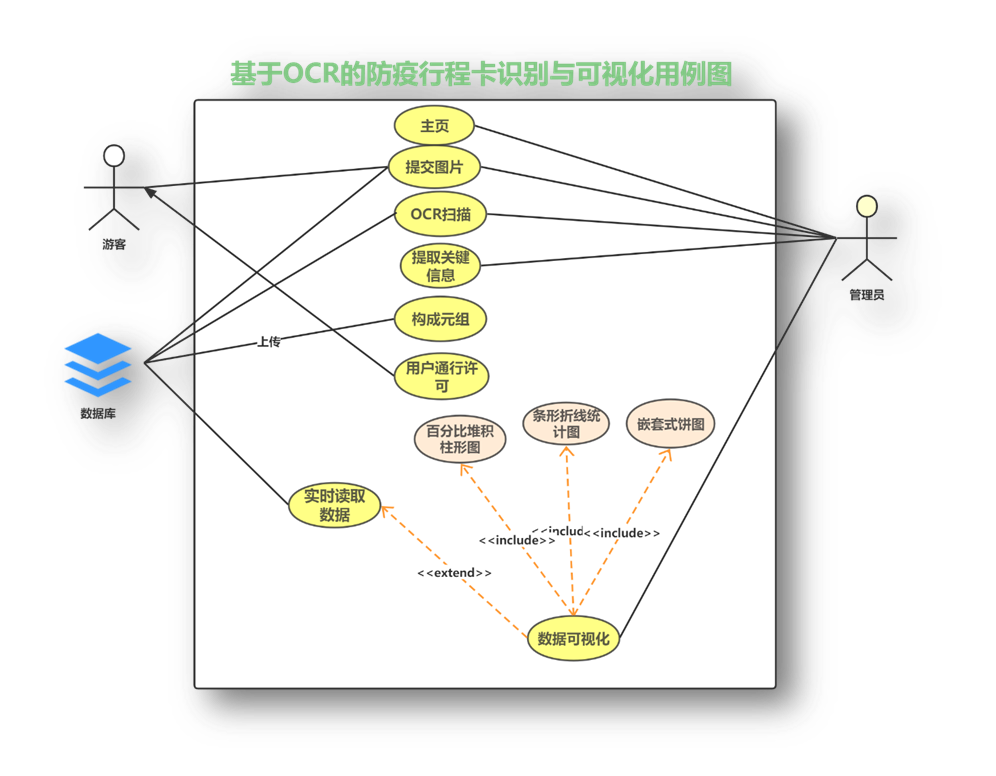
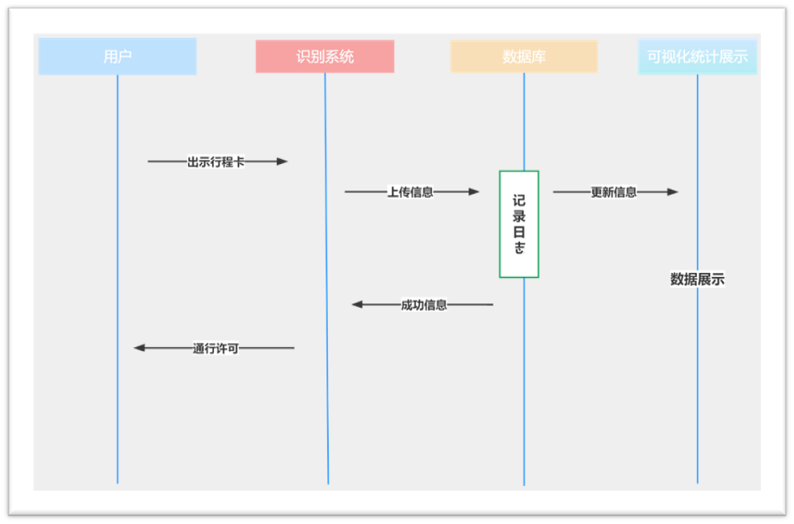

# 🌐 Communication Trip Route Card Recognition and State Visualization based on OCR

## 🚀 1. Introduction

In the wake of the COVID-19 pandemic, the travel landscape in China underwent significant changes. One such change was the introduction of the COVID trip route card, an essential document for traveling. This project focuses on leveraging OCR technology to recognize and visualize data from these cards, ensuring a seamless experience for travelers and administrators alike, and playing a pivotal role in pandemic management and reducing the labor consuming.

## 📊 2. Project Overview

### 🔍 2.1 OCR Neural Network Enhancement

After evaluating the recognition accuracy of mainstream OCR frameworks on various COVID trip route card test sets, I refined the neural network structure. This enhancement significantly boosted the recognition accuracy, ensuring precise data extraction from the trip route cards.

### 📚 2.2 Database Connection

To store images and their corresponding identification information, I integrated the MySQL database using Navicat. This robust connection ensures that all data is securely stored and can be easily retrieved for further processing or analysis.

### 🖥️ 2.3 OCR Recognition System

The heart of this project is the OCR recognition system, built using the PySide6 framework. Key features include:

- **Batch Recognition**: Leveraging multi-threading, the system can recognize multiple COVID trip route cards simultaneously, ensuring rapid processing.

  

- **Data Visualization**: Post-recognition, the data undergoes statistical collation, allowing for intuitive visualization. This aids in understanding patterns, trends, and anomalies in the trip route card data.

  
  

## 🎨 3. Figures

- **System Architecture Module**:

  

- **System Use Case**: 

  

- **System Sequence**: 

  

### 🛠️ System Details

#### File Reading Section

This section supports the simultaneous import of multiple files, considering that batch processing is often required in real-world applications. It also supports file drag-and-drop for input. With the integration of a GPU acceleration module and the use of a deep learning framework, the system efficiently processes text under GPU acceleration.

#### Image Processing Area

The images being processed are displayed in this area. A dynamically growing progress bar on the right shows the image reading progress. Once all files in a batch are read, the progress bar fills up, displaying a checkmark. Importantly, multi-threading is implemented to ensure efficient processing, even with GPU handling. This means the main thread remains unblocked, allowing users to switch to other interfaces while the child thread processes the text.

#### Post-Reading Organization Table

All read data is organized in this section. Using regular expressions, key information is extracted and categorized in a table. For practicality, the table supports direct editing, allowing for corrections in case of OCR errors. Features also include clearing the table and deleting selected rows (with multi-select delete support).
